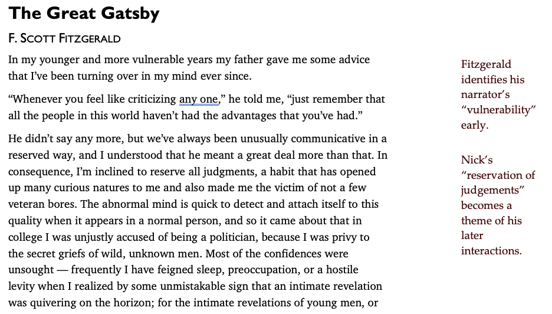

A set of templates and other assets designed to create a consistent, user-accessible, and naturalistic style for physical documents viewer on paper and on screen.

## Features
- A earth toned, tetrad-based color scheme with text colors that meet [WCAG AAA guidelines](http://colorsafe.co/) when used on a #ffffff background.
- In Word templates, heavy use of the [Styles](https://support.office.com/en-us/article/Customize-or-create-new-styles-d38d6e47-f6fc-48eb-a607-1eb120dec563) feature to ease common formatting and cross-system compatibility.
- Use of fonts included with Microsoft Office to maxmize compatibility when sending files to others. If you have more creative freedom, I encourage you to fork the project and substitue other type families or build in other unique elements of branding.

## Word Templates

### Outline

  

An outline format with APA-compatible numbering designed to support casual brainstorming.

### Colorful Outline

  
  

  
Like Outline, but with colors. I find the colors make things easier to read; your milage may vary.

### Tufte

  

A handout layout inspired by the practice of [Edward Tufte](https://www.edwardtufte.com) relying on heavy use of side notes (due to Word limitations, side notes sit in text boxes - I recommend you copy/paste the example side note and format to your needs).

