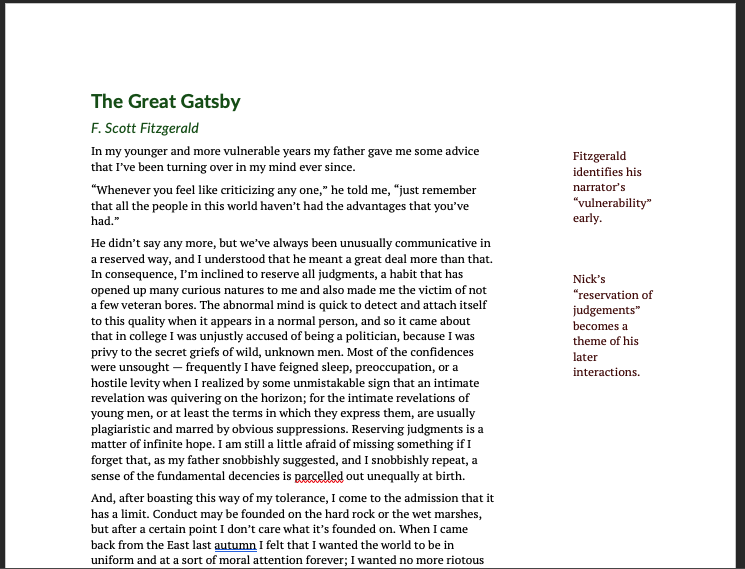

A set of templates and other assets designed to create a consistent, user-accessible, and naturalistic style for documents both physical and on the modern web.

# Features
- A earth toned, tetrad-based color scheme with text colors that meet [WCAG AAA guidelines](http://colorsafe.co/) when used on a #ffffff background.

# Recommendations 
- Cascadia's house font families are [Lato by Łukasz Dziedzic](http://www.latofonts.com/lato-free-fonts/) (sans) and [PT Serif by Alexandra Korolkova and colleagues](https://old.paratype.com/public/) (serifs). Both are available under the [SIL Open Font License](https://scripts.sil.org/cms/scripts/page.php?item_id=OFL_web).  However, you're encouraged to use whatever fonts suit your brand and style. When sharing documents within an organization, it can be helpful to use font families built into the Microsoft Office suite - I recommend Corbel Bold in place of Lato Regular and Palatino in place of PT Serif for closest results.

# Word Templates
- Outline: A colorful outline format with APA-compatible numbering designed to support casual brainstorming.

- Tufte Handout: A document layout inspired by the practice of Edward Tufte relying on heavy use of side notes (due to Word limitations, side notes sit in text boxes - I recommend you copy/paste the example side note and format to your needs).

