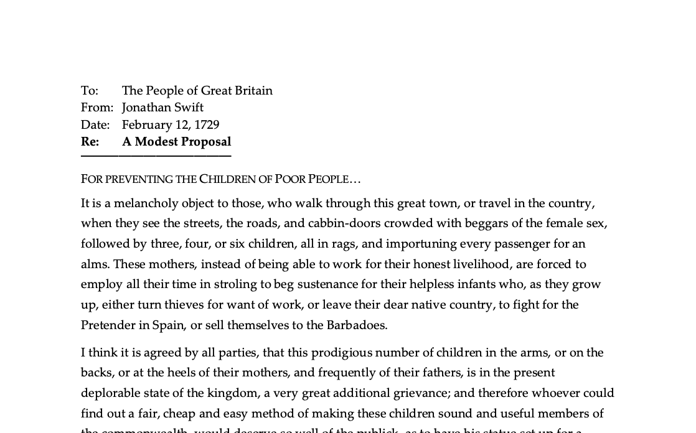
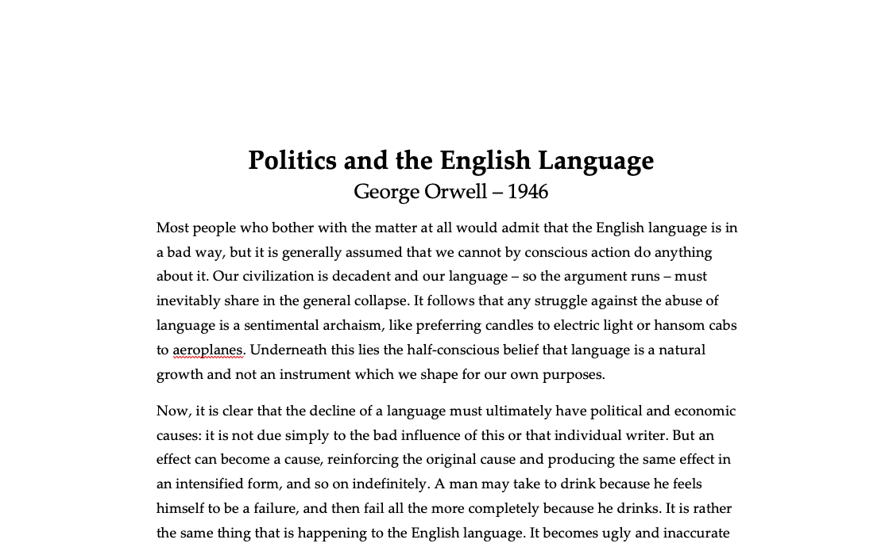
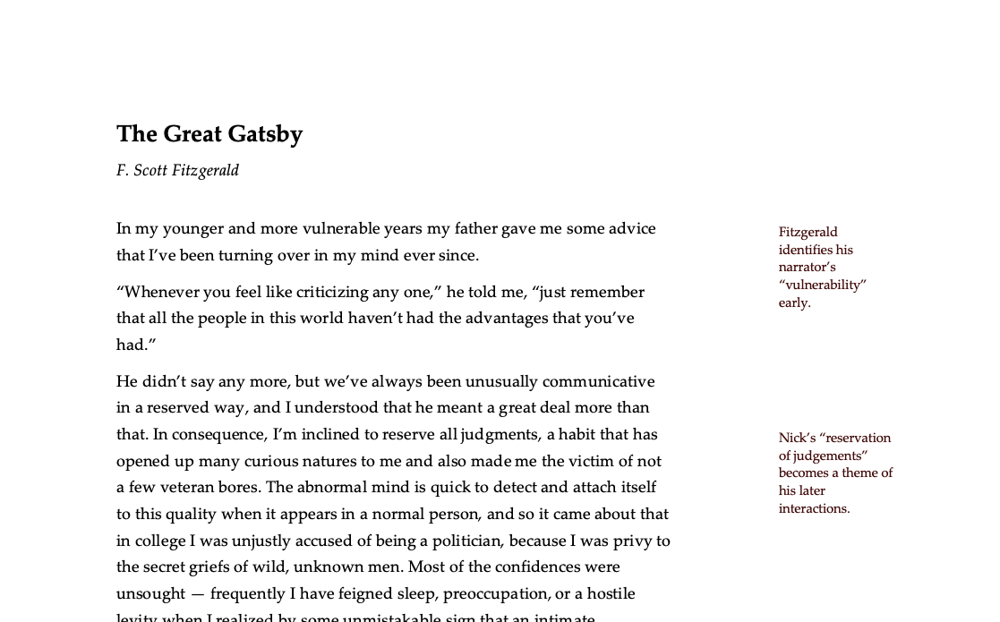

A set of templates and other assets designed to create a consistent, user-accessible, and naturalistic style for physical documents viewer on paper and on screen.

## Features
- Serif: Palatino Linotype, designed by Hermann Zapf for Microsoft to adapt Palatino to digital publishing. Use of a common font built into Microsoft Office helps maxmize compatibility when sending files to others. If you have more creative freedom, I encourage you to fork the project and substitue other type families or build in other unique elements of branding.
- Sans Serif: Gill Sans MT, a distinctive heading face by Eric Gill that is similarly adapted to digital puiblishing and widely available for compatibility.
- A earth toned, tetrad-based color scheme with text colors that meet [WCAG AAA guidelines](http://colorsafe.co/) when used on a #ffffff background.
- In Word templates, heavy use of the [Styles](https://support.office.com/en-us/article/Customize-or-create-new-styles-d38d6e47-f6fc-48eb-a607-1eb120dec563) feature to ease common formatting and cross-system compatibility.

## Word Templates

### Outline

  

An outline format with APA-compatible numbering designed to support casual brainstorming.

### Colorful Outline

  
  

  
Like Outline, but with colors. I find the colors make things easier to read; your milage may vary.

### Memo

  

A tight, neutral memo layout which is useful for short write ups or other kinds of documents where the best format is somewhat ambiguous. The header can be modified as apporpriate with other metadata, logos, etc.

### Report

  

A wide margined, easy-to-read style for longer narrative documents.

### Tufte Handout

  

A handout layout inspired by the practice of [Edward Tufte](https://www.edwardtufte.com) relying on heavy use of side notes (due to Word limitations, side notes sit in text boxes - I recommend you copy/paste the example side note and format to your needs).

